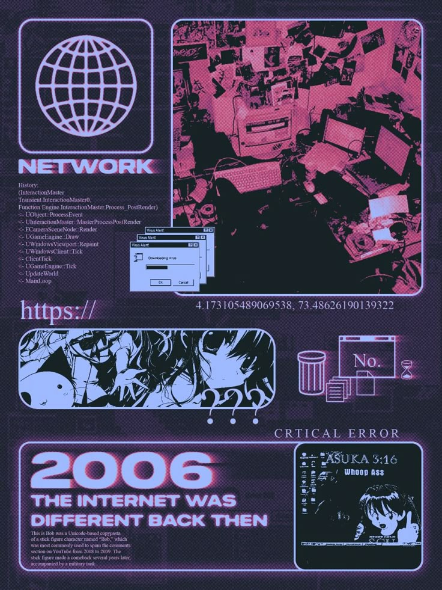

<div align="center">


<br>

### `> initializing_profile.exe`

# HELLO, I'M ADITI

### `// Cloud & DevOps Engineer • Cybersecurity • AI/ML • Research`

`CLOUD & DEVOPS`   `CYBERSECURITY`   `AI / ML`   `RESEARCH`

```text
$ while(alive) { code(); learn(); build(); inspire(); }
```

</div>

---

<table width="100%">
<tr>

<td width="25%" valign="top">

<div align="center">


### `AditiMishra02`

`@AditiMishra02`

`未来を作る。`

**Build • Learn • Research**

</div>

---

### `> SYSTEM INFO`

```text
NAME
Aditi Mishra

ROLE
Cloud & DevOps Engineer

LOCATION
India 🇮🇳

STATUS
● Open To Work

FOCUS
Cloud • DevOps
Cybersecurity
AI / ML
Research
```

---

### `> CONNECT`

<div align="center">

</div>

---

### `> PROFILE`

```text
BUILD
LEARN
RESEARCH
REPEAT
```

</td>

<td width="75%" valign="top">

# `> HELLO, I'M ADITI`

<table width="100%">
<tr>

<td width="58%" valign="top">

```text
╔══════════════════════════════════════╗
║                                      ║
║  CLOUD • DEVOPS • SECURITY • AI      ║
║                                      ║
║  I build cloud-based systems,        ║
║  automate deployment workflows,      ║
║  and explore secure intelligent      ║
║  systems.                            ║
║                                      ║
║  Currently exploring:                ║
║                                      ║
║  AWS • Docker • Terraform • CI/CD    ║
║  Kubernetes • Cybersecurity • AI/ML  ║
║                                      ║
╚══════════════════════════════════════╝
```

</td>

<td width="42%" valign="top">

### `> CURRENT MISSION`

```text
[+] Cloud solutions
[+] Deployment automation
[+] Cybersecurity
[+] AI / Machine Learning
[+] Research

STATUS

███████████████░░░░░
78%
```



</td>

</tr>
</table>

### `> PHILOSOPHY`

> **「コードを書くことは、未来を書くこと。」**
> *To write code is to write the future.*

</td>

</tr>
</table>

---

# `> TECH STACK`

<table width="100%">
<tr>

<td width="33%" valign="top">

## ☁️ CLOUD & DEVOPS

**AWS**

`██████████████████░░` **90%**

**Docker**

`██████████████████░░` **90%**

**Linux**

`█████████████████░░░` **85%**

**Terraform**

`████████████████░░░░` **80%**

**GitHub Actions / CI-CD**

`█████████████████░░░` **85%**

</td>

<td width="33%" valign="top">

## 💻 LANGUAGES

**Python**

`██████████████████░░` **90%**

**Bash**

`████████████████░░░░` **80%**

**SQL**

`██████████████░░░░░░` **70%**

**Java**

`████████████░░░░░░░░` **60%**

</td>

<td width="33%" valign="top">

## 🛡️ TOOLS & SECURITY

**Kubernetes**

`███████████████░░░░░` **75%**

**Postman**

`███████████████░░░░░` **75%**

**VS Code**

`██████████████████░░` **90%**

**JWT / APIs**

`████████████████░░░░` **80%**

</td>

</tr>
</table>

---

# `> FEATURED PROJECTS`

<table width="100%">
<tr>

<td width="25%" valign="top">

<div align="center">

### ☁️ CLAMS

**Cloud Log Aggregation**
**& Monitoring System**

</div>

---

**STACK**

`Python` `Flask`

`AWS S3` `Docker`

`GitHub Actions`

---

**DESCRIPTION**

Cloud-based log ingestion and monitoring system with automated CI/CD.

<br>

**TYPE**

`CLOUD • DEVOPS`

</td>

<td width="25%" valign="top">

<div align="center">

### 🔐 CLUDRIVE

**Secure Cloud File**
**Storage Platform**

</div>

---

**STACK**

`Flask` `AWS S3`

`JWT` `SQLite`

`Docker`

---

**DESCRIPTION**

Secure cloud storage platform with authentication, file upload/download and metadata management.

<br>

**TYPE**

`CLOUD • SECURITY`

</td>

<td width="25%" valign="top">

<div align="center">

### 🚀 PRODDEPLOY

**Production-Ready**
**CI/CD Pipeline**

</div>

---

**STACK**

`Flask` `Docker`

`GitHub Actions`

`AWS EC2` `Nginx`

---

**DESCRIPTION**

Automated build and deployment pipeline for a Python API.

<br>

**TYPE**

`DEVOPS • CI/CD`

</td>

<td width="25%" valign="top">

<div align="center">

### 🛡️ THREAT MONITOR

**DevSecOps Threat**
**Monitoring Dashboard**

</div>

---

**STACK**

`Flask` `Docker`

`JWT` `Chart.js`

`DevSecOps`

---

**DESCRIPTION**

Security-focused monitoring dashboard built around DevSecOps concepts.

<br>

**TYPE**

`SECURITY • DEVSECOPS`

</td>

</tr>
</table>

---

# `> EXPERIENCE`

<table width="100%">
<tr>

<td width="12%" valign="top">

### `01`

</td>

<td width="88%" valign="top">

### Graduate Engineer Trainee

**HCL Technologies**

`Infrastructure` • `VDI` • `Enterprise IT` • `Cloud`

Experience with enterprise infrastructure and VDI environments, including **Citrix XenServer, VDI provisioning, ServiceNow, user onboarding and secure enterprise systems.**

</td>

</tr>
</table>

---

# `> RESEARCH INTERESTS`

<table width="100%">
<tr>

<td width="55%" valign="top">

```text
╔══════════════════════════════════════╗
║  🧠 Artificial Intelligence         ║
║  🤖 Machine Learning                ║
║  🛡️ Cybersecurity                   ║
║  ☁️ Cloud Security                  ║
║  🔎 Malicious URL Detection         ║
║  ⚙️ DevSecOps                       ║
║  🔐 AI + Cybersecurity              ║
║  ☁️ AI + Cloud Computing            ║
╚══════════════════════════════════════╝
```

</td>

<td width="45%" valign="middle">

### `> RESEARCH MODE`

Interested in the intersection of:

# `AI × CYBERSECURITY × CLOUD`

Long-term interests:

`Advanced Research`

`Research Engineering`

`PhD Opportunities`

</td>

</tr>
</table>

---

# `> LANGUAGES`

<table width="100%">
<tr>

<td align="center" width="25%">

### 🇬🇧 GB

## English

</td>

<td align="center" width="25%">

### 🇮🇳 IN

## Hindi

</td>

<td align="center" width="25%">

### 🇩🇪 DE

## German

</td>

<td align="center" width="25%">

### 🇯🇵 JP

## Japanese

</td>

</tr>
</table>

---

# `> CURRENTLY LEARNING`

<table width="100%">

<tr>
<td width="35%">

**AWS & Cloud Architecture**

</td>
<td>

`████████████████░░░░` **80%**

</td>
</tr>

<tr>
<td>

**Cybersecurity**

</td>
<td>

`███████████████░░░░░` **75%**

</td>
</tr>

<tr>
<td>

**DevSecOps**

</td>
<td>

`██████████████░░░░░░` **70%**

</td>
</tr>

<tr>
<td>

**Kubernetes**

</td>
<td>

`█████████████░░░░░░░` **65%**

</td>
</tr>

<tr>
<td>

**AI / Machine Learning**

</td>
<td>

`████████████░░░░░░░░` **60%**

</td>
</tr>

<tr>
<td>

**Research & Academic Writing**

</td>
<td>

`███████████░░░░░░░░░` **55%**

</td>
</tr>

</table>

---

# `> GITHUB STATS`

<div align="center">


</div>

---

# `> CONTRIBUTION MATRIX`

<div align="center">


</div>

---

<div align="center">

```text
╔══════════════════════════════════════════════╗
║                                              ║
║       YOU HAVE ENTERED ADITI'S SYSTEM        ║
║                                              ║
║            BUILD • LEARN • RESEARCH          ║
║                                              ║
╚══════════════════════════════════════════════╝
```


<br><br>

### `未来を作る。`

**BUILD THE FUTURE.**

</div>
