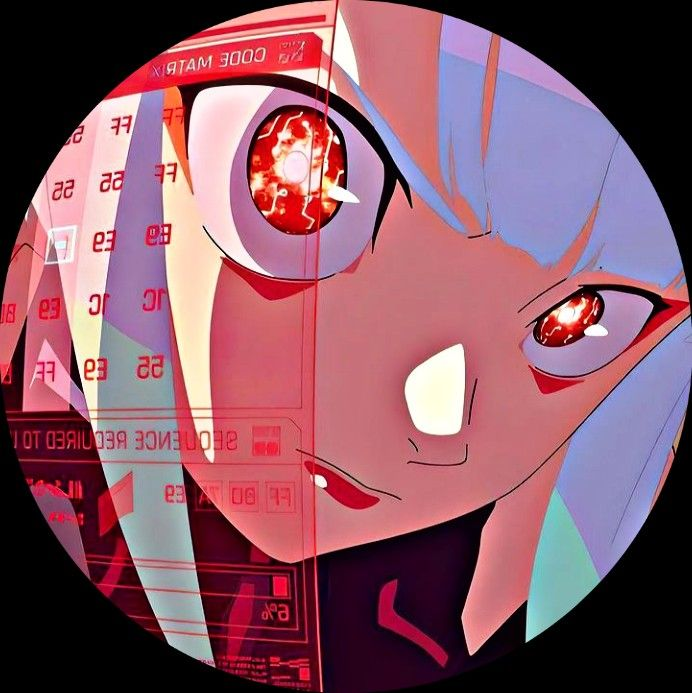

> initializing_profile.exe

<table width="100%">
<tr>

<td width="22%" valign="top" align="center">

AditiMishra02

未来を作る。

Build • Learn • Research

> SYSTEM LOCATION

India 🇮🇳

> ROLE

Cloud & DevOps Engineer

> CONNECT

  

> LANGUAGES

🇬🇧 English
🇮🇳 Hindi
🇩🇪 German
🇯🇵 Japanese

</td>

<td width="78%" valign="top">

> PHILOSOPHY

「コードを書くことは、未来を書くこと。」
To write code is to write the future.

> ABOUT

I build cloud-based systems, automate deployment workflows,
and explore secure intelligent systems.

My current focus : Cloud • DevOps • Cybersecurity • AI / ML

> EXPERIENCE

 Graduate Engineer Trainee

HCLTech

Infrastructure VDI Enterprise IT Cloud

Supported Deutsche Bank's Secure Desktop On Demand (SDOD) platform within a Citrix-based virtualized infrastructure environment.

Managed VDI provisioning, user onboarding, access management, and MFA workflows.

Performed VDI reallocations across global regions to improve connectivity and resource utilization.

Troubleshot infrastructure, application availability, and deployment issues within virtual desktop environments.

Managed incidents and service restoration through ServiceNow while collaborating with infrastructure teams.

Supported Citrix XenServer and Linux environments while following security and access-control standards.

Technologies : Citrix XenServer,VDI, ServiceNow,Linux,MFA, Access Management

</td>

</tr>
</table>

> TECH STACK

<table width="100%">
<tr>

<td width="25%" valign="top">

☁️ CLOUD & DEVOPS

AWS

EC2 S3 IAM

Containers

Docker

CI/CD

GitHub Actions

Systems

Linux Bash

Version Control

Git GitHub

</td>

<td width="25%" valign="top">

💻 PROGRAMMING

Language

Python

Backend

Flask

APIs

REST APIs

Authentication

JWT

Database / Data

SQL Pandas

</td>

<td width="25%" valign="top">

🛡️ INFRASTRUCTURE

Virtualization

Citrix XenServer
VDI

Operations

ServiceNow

Access

MFA
Access Management

Infrastructure

Enterprise IT
Linux

</td>

<td width="25%" valign="top">

🤖 MACHINE LEARNING

Libraries

scikit-learn
Pandas
NumPy

Algorithms

Random Forest
SVM
Logistic Regression

ML

Feature Engineering
Model Evaluation
Cross-Validation

</td>

</tr>
</table>

> FEATURED PROJECTS

<table width="100%">
<tr>

<td width="50%" valign="top">

☁️ CLAMS

Cloud Log Aggregation & Monitoring System

Cloud-based log ingestion and monitoring system with automated CI/CD.

Python Flask AWS S3
Docker GitHub Actions

→ View Repository

</td>

<td width="50%" valign="top">

🔒 CLUDRIVE

Secure Cloud File Storage Platform

Secure cloud storage platform with authentication, file operations and metadata management.

Flask AWS S3 JWT
SQLite Docker

→ View Repository

</td>

</tr>

<tr>

<td width="50%" valign="top">

🚀 PRODDEPLOY

Production-Ready CI/CD Pipeline

Automated build and deployment pipeline for a Python API.

Flask Docker
GitHub Actions AWS EC2 Linux

→ View Repository

</td>

<td width="50%" valign="top">

🛡️ THREAT MONITOR

DevSecOps Threat Monitoring Dashboard

Security-focused monitoring dashboard built around DevSecOps concepts.

Flask Docker JWT
Chart.js DevSecOps

→ View Repository

</td>

</tr>
</table>

> RESEARCH INTERESTS

<table width="100%">
<tr>

<td width="50%" valign="top">

🧠 Artificial Intelligence

🤖 Machine Learning

🛡️ Cybersecurity

☁️ Cloud Security

🔎 Malicious URL Detection

</td>

<td width="50%" valign="top">

⚙️ DevSecOps

🔐 AI + Cybersecurity

☁️ AI + Cloud Computing

🔬 Research Engineering

💻 Advanced Computing

</td>

</tr>
</table>

> CURRENTLY LEARNING

<table width="100%">
<tr>

<td width="50%" valign="top">

☁️ AWS & Cloud Architecture

████████░░ 80%

🛡️ Cybersecurity

███████▌░░ 75%

⚙️ DevSecOps

███████░░░ 70%

</td>

<td width="50%" valign="top">

☸️ Kubernetes

██████▌░░░ 65%

🤖 AI / Machine Learning

██████░░░░ 60%

✍️ Research & Academic Writing

█████▌░░░░ 55%

</td>

</tr>
</table>

> GITHUB STATS

  

  

  

╔══════════════════════════════════════════════╗
║                                              ║
║       YOU HAVE ENTERED ADITI'S SYSTEM       ║
║                                              ║
║          BUILD • LEARN • RESEARCH           ║
║                                              ║
╚══════════════════════════════════════════════╝

未来を作る。

BUILD THE FUTURE.

